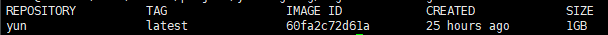

## 一、docker安装
### 1.1 ubuntu环境docker安装
使用apt-get获取仓库   

    $ sudo apt-get install apt-transport-https ca-certificates curl gnupg-agent software-properties-common
添加官方密钥   

    $ curl -fsSL https://download.docker.com/linux/ubuntu/gpg | sudo apt-key add -
安装容器等   

    $ sudo apt-get install docker-ce docker-ce-cli containerd.io
测试Docker是否安装成功   
    $ sudo docker run hello-world

### 1.2 windows环境docker安装
暂无   

## 二、docker基本使用
拉取官方镜像   
    docker pull hello-world:latest   
其中hello-world为docker镜像名称，latest为版本号   
使用***docker images***命令可以显示已有的镜像   

运行容器   
    $ docker run -d -i -t 60fa2c72d61a /bin/bash   
其中-d表示容器在后台运行、-i表示打开STDIN，用于控制台交互、-t表示支持终端登录、60fa2c72d61a表示镜像ID（也可以使用yun:latest方式代替）、/bin/bash表示在容器中执行/bin/bash命令、其他具体命令可用***docker run --help***查看   
查看已有容器   
    $ docker ps   

